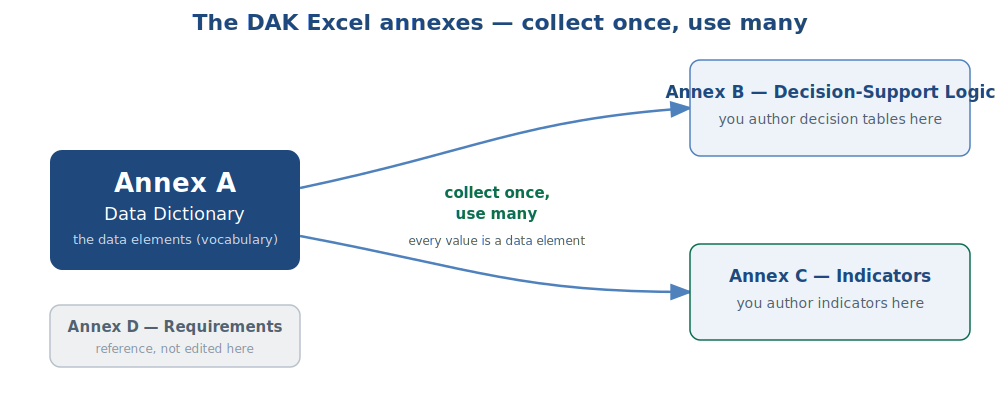
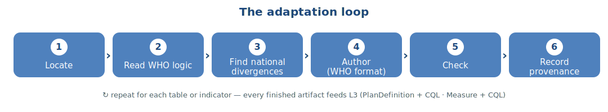
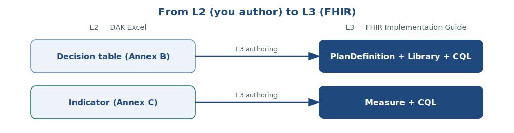
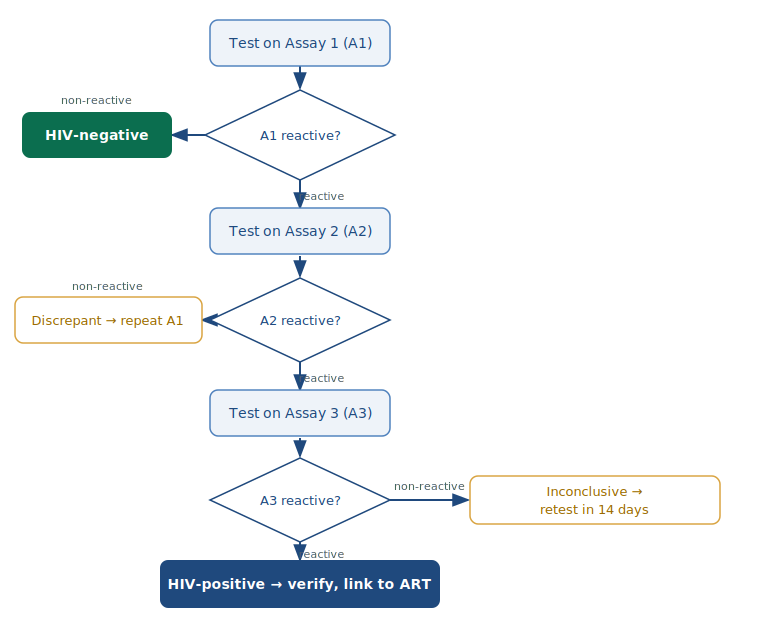
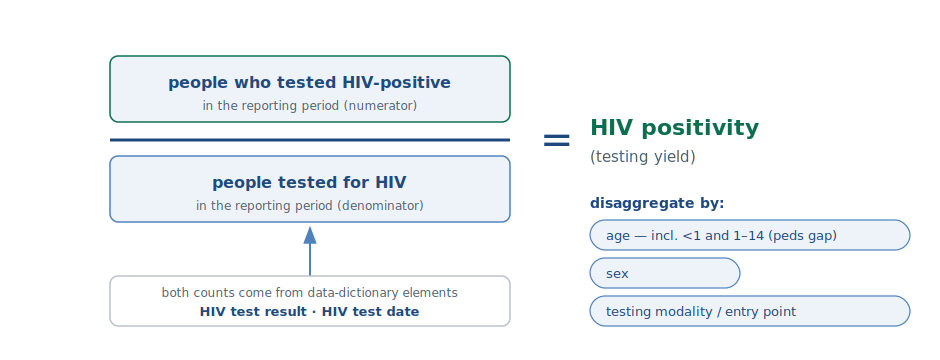

# Tutorial — Adapting WHO HIV DAK L2 Artifacts to Ethiopia

A hands-on walkthrough. By the end you can: read each DAK annex, follow the WHO authoring conventions, and adapt **two kinds of artifact** to Ethiopia — a **decision-support table** and an **indicator** — in the exact format that feeds the L3 FHIR Implementation Guide.

> **Start here:** Ethiopia's DAK is **already heavily localized** — the data dictionary differs from the WHO default by 298 added, 204 removed, and 1,124 modified elements (full delta in the companion **change report**). So the work is **reviewing, wiring, and validating** what already exists, not authoring from a blank generic DAK. The two cheat sheets capture the repeatable recipe; `[confirm: ETH]` marks the few points still to settle against national guidelines.

---

## Part 1 — Orientation: the files you work in

A WHO DAK ships as a narrative PDF plus four Excel **web annexes**. Three matter here, wired together by one rule — **collect once, use many times**: every value a decision table or indicator uses must first exist as a **data element** in the data dictionary.

### 1a · Data Dictionary (Annex A)
The project's **vocabulary**. Organized into **12 clinical module tabs** (Registration, HTS visit, PrEP visit, Care-Treatment, HIV-TB, PMTCT, Diagnostics, Follow-up, Referral, Prevention, Surveillance, Configuration), plus COVER and README. *(WHO HIV DAK 2nd ed.; data dictionary v1.0.0-beta.)*

**How to read a row** — each row is one data element:

| Column | What it tells you |
|---|---|
| Activity ID | the workflow step it belongs to |
| **Data Element ID** | the stable handle, e.g. `HIV.B.DE94` |
| Data Element Label | human name, e.g. "Test result of HIV assay 1" |
| Description and Definition | meaning, units |
| Multiple Choice | Select one / Select all that apply / Input Option |
| Data Type | Boolean, String, Date, DateTime, ID, Quantity, Coding, **Codes**, … |
| Input Options | the coded answer options |
| Quantity Sub-type | Integer / Decimal / Duration |
| Calculation · Validation Condition | derivation formula; data-entry rules |
| Required | **R** required / **O** optional / **C** conditional |
| **Linkages to Decision Support Tables** | which table(s) consume this element |
| **Linkages to aggregate indicators** | which indicator(s) consume this element |
| Mapping to code systems (+ relationship) | ICD-11 / LOINC / SNOMED / national codes; Equivalent / narrower / broader |

The two **Linkage** columns are your map: filter a module tab by them to see exactly which elements feed a given table or indicator.

### 1b · Decision-Support Logic (Annex B) — *you author here*
One table per decision point, written as a **DMN** (Decision Model and Notation) spreadsheet. Column convention used by the WHO HIV IG:
`Rule ID` · `Condition Inputs` (one column per input element) · `Output Type` · `Action` · `Guidance` · `Annotations` · `Reference(s)` — with a declared **Hit Policy** (e.g. *Rule order*) and explicit operators (`=`, `IN`, `>=`, `<`, `is NULL`, `=True/=False`). Read a rule left-to-right: *when the inputs match these conditions → produce this output and action.*

### 1c · Indicators (Annex C) — *you author here*
One block per indicator, using the L2 template fields: **short name · indicator definition · category · what it measures · rationale · numerator definition · numerator calculation · denominator definition · denominator calculation · disaggregation description · reference** (plus DAK ID and the WHO Strategic Information reference number). Read an indicator by checking its numerator/denominator point at real **data-dictionary elements**.

### 1d · Requirements (Annex D)
Functional / non-functional system requirements. Not edited in this session; know it exists.

---

## Part 2 — The authoring method

Adapting any artifact follows the same loop. You start from the WHO version (never a blank page) and author the **~20%** that is national.

The rules that keep an artifact valid:
- **Collect once, use many** — every value used must be a data element in Annex A. Need one that isn't there? **Add it to the dictionary first.**
- **Changes propagate** — add, remove, or re-value a data element and you must update every table and indicator linked to it. The *Linkages to Decision Support Tables / aggregate indicators* columns in Annex A are your impact map.
- **Decision tables follow DMN** and stay small — **avoid 10+ inputs** (split into separate tables).
- **Indicators must be computable** from routine data. If a metric needs a survey or external aggregate (e.g. condoms distributed, key-population coverage), it is **not** a DAK indicator — it is measured elsewhere.
- **Preserve clinical-safety logic** when you adapt — don't drop a WHO rule by accident.
- **Record provenance** — note what diverged from the WHO DAK and why; track the version.

A finished artifact is the direct input to the L3 FHIR IG:

---

## Part 3 — Walkthrough 1: a decision-support table

*Example: the national HIV testing algorithm.*

**What a decision-support table is.** A set of rules that turn recorded inputs into a recommended output/action — the computable form of "if the guideline says X, do Y." A national HIV testing algorithm is one of the most country-specific examples: every country sets its own assays and test sequence.

**What Ethiopia already changed here.** `HIV.B7.DT` is one of the most-adapted tables in the dictionary (+21 / −1 / 31 modified): Ethiopia added an **"Invalid"** result value, **verification-on-discordance** and **retest-before-ART** steps (the latter wired to `HIV.D12.DT`), and a **maternal-serology reuse** in PMTCT. Some additions still have **blank linkage cells** — so this walkthrough is about **wiring and reconciling those existing changes**, not authoring from scratch.

The logic you are encoding:

**Step 1 — Locate.** In the Data Dictionary → HTS visit tab, filter *Linkages to Decision Support Tables* for the testing-algorithm table. You get its inputs and output, including: `HIV.B.DE90/91/92` (**Assay 1/2/3**), `HIV.B.DE94 / DE97 / DE100` (**Test result of HIV assay 1/2/3**, coded *Reactive/Non-reactive*), `HIV.B.DE93` (**Assay 1 repeated**) with its result `HIV.B.DE103`, and `HIV.B.DE107` (**HIV test result** — the output; coded HIV-positive / HIV-negative / HIV-inconclusive).

**Step 2 — Read the WHO logic.** Write down the safety invariants you must keep: everyone tested on Assay 1; **A1 non-reactive → HIV-negative**; reactive proceeds **serially A1 → A2 → A3**; **discrepant** (`A1+ ; A2−`) → **repeat Assay 1**; **inconclusive → retest at visit date + 14 days**; infants <18 months → route to EID/virologic logic.

**Step 3 — Find the national divergences** `[confirm: ETH]`: which national products are A1/A2/A3; serial vs any parallel step; the retest interval; whether re-test-to-verify before ART is required; which entry points/modalities are in use.

**Step 4 — Author** (in the Annex B format; Hit Policy = *Rule order*). Each input cell points at a dictionary element + coded option, not free text:

| Rule ID | Result A1 (`DE94`) | Result A2 (`DE97`) | Result A3 (`DE100`) | Output: HIV test result (`DE107`) | Action / Guidance |
|---|---|---|---|---|---|
| B7-R1 | `= Non-reactive` | — | — | HIV-negative | report negative; window-period retest if recent exposure |
| B7-R2 | `= Reactive` | `= Reactive` | `= Reactive` | HIV-positive | verify per policy; link to ART |
| B7-R3 | `= Reactive` | `= Reactive` | `= Non-reactive` | HIV-inconclusive | retest at visit date **+14 days** `[confirm: ETH]` |
| B7-R4 | `= Reactive` | `= Non-reactive` | — | (discrepant) | repeat Assay 1 (`DE93`), record result (`DE103`); if still discordant → inconclusive → retest +14d |

**Step 5 — Check.** ≤10 inputs ✓; every input/output is a dictionary element ✓; all safety invariants present ✓; add `Reference(s)` (WHO HTS 2019 + the Ethiopia national HTS guideline).

**Step 6 — Record provenance.** In `Annotations`, note what changed from the WHO generic table and why (e.g. "A1/A2/A3 set to national products X/Y/Z per Ethiopia HTS guideline").

**Produce it (the workshop output).** Open the WHO **Annex B** (`2023.28`), sheet `HIV.B7.DT`. The current rules `B7.DT.01–08` branch only on Reactive/Non-reactive — **add the Invalid branch(es)** (Invalid on an assay → handle per national SOP), confirm the national assays in the `HIV test type` condition, and save it as the Ethiopia Annex B. That edited sheet **is** the deliverable.

**Where it goes (L3).** This table becomes a FHIR `PlanDefinition` + `Library` + CQL — preserve the rules above so the safety behavior is not re-broken downstream.

---

## Part 4 — Walkthrough 2: an indicator

*Example: HIV testing positivity (yield).*

**What an indicator is.** A measured number — a numerator over a denominator, built from recorded data — used to monitor program performance. HIV testing positivity runs off the **same** element the testing algorithm produces (the HIV test result, `HIV.B.DE107`), so one piece of logic serves both care and reporting.

**Two Ethiopia wrinkles to handle.** The HIV test result now **also lives in Ethiopia's new Surveillance module** (`HIV.Surveil.DE2`) — so decide the **source of truth** the indicator reads. And several referenced elements moved or changed in the DD — so positivity uses the **localized** result and disaggregation value sets (re-point and adopt them as-is).

The shape you are encoding:

**Step 1 — Locate.** Confirm it's **computable**: positivity = (tested-positive) / (tested), both counts over routine data ✓. (Contrast metrics that need a survey or external/aggregate source — condoms distributed, needle/syringe, condom use, KP-know-status, KP-on-ART — which are *not computable from routine DAK data*; they are measured elsewhere, not authored as DAK logic.)

**Step 2 — Read the WHO logic.** The numerator and denominator both reference data elements that already exist in the dictionary — **HIV test result** (`HIV.B.DE107`) and **HIV test date**. Nothing new to add.

**Step 3 — Find the national divergences** `[confirm: ETH]`: which disaggregations Ethiopia reports, and the exact national definitions of "tested" and "positive" so the indicator reconciles with existing figures.

**Step 4 — Author** (in the Annex C template):
- *Numerator definition:* individuals with **HIV test result = HIV-positive** in the reporting period. *Calculation:* `COUNT clients where [HIV test result]=HIV-positive AND [HIV test date] in period`.
- *Denominator definition:* individuals **tested** in the period. *Calculation:* `COUNT clients where [HIV test date] in period`.
- *Disaggregation:* **age incl. <1 and 1–14** (the pediatric gap), sex, testing modality/entry point, location.
- *Reference / DAK ID / SI ref:* fill from the DAK indicators annex.

**Step 5 — Check.** Numerator and denominator come only from dictionary elements ✓; align to national reporting (**PEPFAR MER `HTS_TST` / `HTS_TST_POS`**; DHIS2/HMIS) `[confirm: ETH]`; **reconcile against a known total** (e.g. last quarter's positives) as a validity check.

**Step 6 — Record provenance.** Note any divergence from the WHO indicator definition and the national reference.

**Produce it (the workshop output).** Open the WHO **Annex C** (`2023.29`), `Indicator definitions`, row **HTS.2**. **Re-point** the named inputs to the localized IDs — `Date HIV test results returned` → `B.DE58`; HIV test date/result → the Surveillance element you chose as source of truth — **add Invalid handling** to the numerator, and set the disaggregation to the localized value sets. The edited row **is** the deliverable. (A "removed" element is usually just renumbered — search the DD by label for the new ID before assuming it's gone.)

**Where it goes (L3).** This indicator becomes a FHIR `Measure` + CQL (sharing a common `IndicatorLogic` library).

---

## Part 5 — Keep going

The loop is always the same — **Locate → read the WHO logic → find the national divergences → author in the WHO format → check → record provenance → hand to L3** — for the next table or indicator. Two one-page cheat sheets — one for **decision tables**, one for **indicators** — are the quick references to keep beside the annexes.
